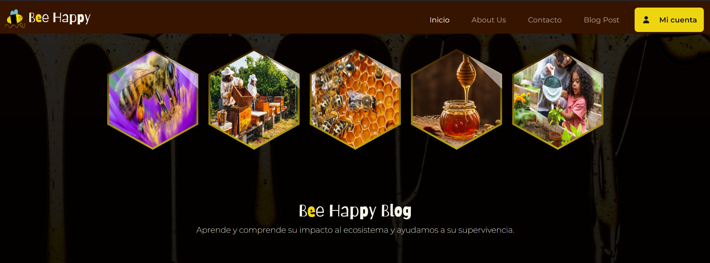
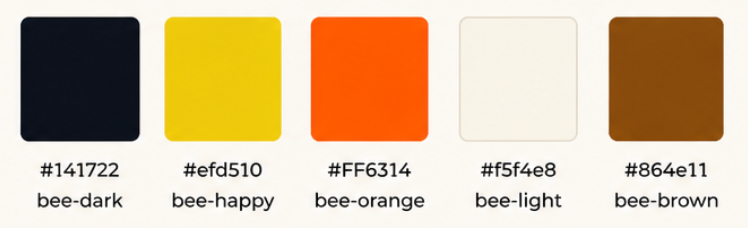

# ¡Bienvenid@s a [Bee Happy](https://bee-happy-production.up.railway.app) Blog!!

## Tabla de contenidos:
* [¿Qué es BEE HAPPY?](#qué-es-bee-happy)
* [Funcionalidad del Proyecto](#funcionalidad-del-proyecto)
* [Experiencia de Usuario](#experiencia-de-usuario)
   * [User Stories](#user-stories)
   * [Diseño](#diseño)
       * [1. Tipografía](#1-tipografía)
       * [2. Paleta de Colores](#2-paleta-de-colores)
       * [3. Logotipo](#3-logotipo)
       * [4. Geometría](#4-geometría)
       * [5. Wireframing](#5-wireframing)
* [Tecnología Utilizada](#tecnología-utilizada)
* [Base de Datos](#base-de-datos)
* [Funcionalidades](#funcionalidades)
   * [Futuras funcionalidades](#futuras-funcionalidades)
* [Pruebas](#pruebas)
   * [Diseño defensivo](#diseño-defensivo)
* [Despliegue](#despliegue)
* [Créditos](#créditos)
   * [Agradecimientos Especiales](#agradecimientos-especiales)

***

## ¿Qué es BEE HAPPY?

Este blog se centra en destacar la enorme importancia de las abejas dentro de nuestro ecosistema. Estos pequeños insectos desempeñan un papel fundamental en el equilibrio natural, siendo mucho más que simples productoras de miel. Su labor como polinizadoras es esencial para la reproducción de una gran variedad de plantas, incluyendo muchos de los cultivos que forman parte de nuestra alimentación diaria.

A través de este espacio, no solo quiero dar a conocer los múltiples beneficios que las abejas aportan al medio ambiente, sino también generar conciencia sobre los riesgos que enfrentan actualmente, como el cambio climático, el uso de pesticidas y la pérdida de hábitat.

El objetivo principal del blog es abrir la mentalidad de las personas, fomentar el respeto por la naturaleza y ofrecer información útil y accesible. Además, busca enseñar de manera práctica cómo cada uno de nosotros puede contribuir a la protección de esta especie tan valiosa, ya sea plantando flores adecuadas, evitando productos químicos dañinos o apoyando iniciativas de conservación.

En definitiva, se trata de un espacio educativo y reflexivo que invita a comprender que cuidar de las abejas es, en realidad, cuidar de nuestro propio futuro.

### Favicon del blog

### Funcionalidad del Proyecto
Este proyecto consiste en un blog desarrollado con Django en Python, creado con el objetivo de compartir ideas y conocimientos para personas de todas las edades, especialmente para los amantes de la apicultura. Además, permite reflejar los conocimientos que he adquirido a lo largo de estos años, así como lo aprendido en el curso de confección y publicación de páginas web (HTML, CSS y JavaScript).

[Volver arriba](#tabla-de-contenidos)

## Experiencia de Usuario:
User Experience(UX)

#### User Stories:
_Usuario Genérico (Invitado/Público):_
* Como usuario genérico, quiero poder visualizar diferentes publicaciones relacionadas con las abejas y la apicultura para adquirir conocimientos y apoyar mis investigaciones académicas o personales, sin necesidad de estar registrado.
* Como usuario genérico, quiero tener la opción de registrarme fácilmente en la plataforma para acceder a funcionalidades adicionales y formar parte de la comunidad.

_Usuario Registrado (Con sesión iniciada):_
* Como usuario registrado, quiero poder crear publicaciones sobre apicultura para compartir conocimientos, experiencias y contenido educativo con otros usuarios interesados.
* Como usuario registrado, quiero poder comentar y compartir ideas en las publicaciones para fomentar la interacción y el aprendizaje colaborativo.
* Como usuario registrado, quiero poder seguir a otros usuarios y ser seguido, con el fin de construir una red de contactos con intereses similares.
* Como usuario registrado, quiero poder comunicarme con otros aficionados a la apicultura mediante herramientas de interacción (comentarios o mensajería).
* Como usuario registrado, quiero poder crear, editar y personalizar mi perfil de usuario para reflejar mis intereses, experiencia y actividad dentro del blog.

_Desarrollador:_
* Como desarrollador, quiero ampliar mis conocimientos en distintos lenguajes de programación y tecnologías web mediante la creación de un proyecto funcional.
* Como desarrollador, quiero diseñar y desarrollar un blog accesible, intuitivo y atractivo para todo tipo de usuarios, aplicando principios de UX/UI.
* Como desarrollador, quiero implementar buenas prácticas de desarrollo (arquitectura, escalabilidad y mantenibilidad) para asegurar la calidad del producto.
* Como desarrollador, quiero desplegar una aplicación funcional en un entorno real para simular un producto profesional y mejorar mi experiencia práctica.
* Como desarrollador, quiero que el blog sea didáctico y útil para usuarios que necesiten investigar sobre apicultura, facilitando el acceso a información organizada y de calidad.

#### Diseño

##### 1. Tipografía
La tipografía principal utilizada en el proyecto es __Montserrat, sans-serif__, seleccionada desde Google Fonts por su estilo moderno, limpio y altamente legible. Esta fuente fue elegida debido a que ofrece una excelente experiencia de lectura en dispositivos digitales, facilitando la comprensión del contenido y mejorando la navegación del usuario dentro del blog.

Para complementar la identidad visual del proyecto, se utilizó la tipografía __Barriecito__ en el nombre del logotipo. Esta fuente aporta un estilo más creativo, amigable y dinámico, ayudando a representar la personalidad cercana y didáctica del blog. La combinación entre __Montserrat y Barriecito__ permite equilibrar profesionalismo y creatividad dentro de la interfaz y la identidad de marca.

##### 2. Paleta de Colores

La paleta de colores está inspirada en el mundo de las abejas y la naturaleza:

* El _bee-dark_ aporta elegancia, contraste y profundidad visual.
* El bee-happy representa la energía, vitalidad y el carácter positivo asociado a las abejas.
* El _bee-orange_ añade dinamismo y llama la atención en elementos importantes (botones o acciones).
* El _bee-light_ ofrece equilibrio visual, suavidad y mejora la legibilidad de los contenidos.
* El _bee-brown_ conecta con la tierra, lo orgánico y el entorno natural de las abejas.

En conjunto, esta paleta transmite cercanía, naturaleza y dinamismo, alineándose con la temática del blog.

##### 3. Logotipo
El logotipo fue diseñado por __SophiaJ__ utilizando la herramienta _Procreate_ de Apple.

Representa una abeja en vuelo, simbolizando movimiento, comunidad y trabajo colaborativo. Este elemento visual refuerza la temática del blog y ayuda a generar una identidad clara y reconocible para los usuarios.

##### 4. Wireframing

Los wireframes fueron creados para cada página individual en tres tamaños de pantalla diferentes. Todos los wireframes se encuentran a continuación.

Wireframes

Página de inicio

Page1

Página2

Página de Inicio de sesión/Registro

[Volver arriba](#tabla-de-contenidos)

## Tecnología utilizada

#### Lenguajes, Frameworks, Editores y Control de Versiones:

Para el desarrollo de este proyecto se han utilizado diferentes tecnologías y herramientas. En cuanto a los lenguajes de programación, se ha trabajado con __Python__ para la lógica del servidor, así como __HTML, CSS y JavaScript__ para la estructura, el diseño y la interactividad del sitio web.

El framework principal utilizado ha sido __Django__, que ha permitido desarrollar el blog de manera eficiente, gestionando tanto el backend como la conexión con la base de datos.

Como editor de código, se ha empleado __Visual Studio Code__, debido a su versatilidad y facilidad de uso.

Por último, para el control de versiones se ha utilizado __Git__, junto con la plataforma __GitHub__, lo que ha facilitado el seguimiento de cambios y la organización del proyecto.

#### Herramientas Utilizadas:

En el desarrollo de este proyecto se han utilizado diversas herramientas y tecnologías de apoyo para mejorar tanto el proceso de creación como el despliegue de la aplicación. Entre ellas se encuentra __AWS__, utilizada para el almacenamiento y alojamiento de archivos multimedia en la nube, permitiendo una gestión más segura, escalable y eficiente de las imágenes y recursos del blog.

También se ha utilizado __Procreate__, una aplicación de diseño digital empleada para la creación del logotipo oficial del proyecto, aportando una identidad visual personalizada y creativa acorde con la temática del blog.

Para el despliegue de la aplicación se utilizó __Railway__, una plataforma de hosting moderna que ofrece un excelente soporte para proyectos desarrollados en Python. Esta herramienta fue seleccionada debido a su facilidad de uso, automatización de despliegues y coste accesible, convirtiéndose en una opción ideal para desarrolladores principiantes o proyectos en fase de aprendizaje.

Además, se ha hecho uso de herramientas basadas en inteligencia artificial como apoyo durante el desarrollo del proyecto, especialmente para la mejora y redacción de textos, resolución de dudas técnicas y optimización de ideas relacionadas con diseño, experiencia de usuario y desarrollo web.

## Base de datos

La base de datos utilizada en este proyecto está gestionada a través de __Django__, utilizando su sistema __ORM__ _(Object-Relational Mapping)_, lo que permite interactuar con la base de datos de forma sencilla mediante __Python__.

Se ha creado la base de datos con __Postgresql__ y se han definido distintos modelos para gestionar la información del blog, como usuarios, publicaciones, categorías y comentarios, permitiendo una estructura organizada y eficiente de los datos.

#### Esquema de la Base de Datos:

* 

## Funcionalidades

El proyecto cuenta con varias características clave:

* Registro, inicio de sesión y edición de perfiles de usuario.
* Creación, lectura, modificación y eliminación (CRUD) de publicaciones y categorías.
* Visualización de perfiles de otros usuarios junto con sus publicaciones.
* Sistema de comentarios en los posts.
* Formulario de contacto para comunicarse con el administrador del blog en caso necesario.

[Volver arriba](#tabla-de-contenidos)

#### Futuras funcionalidades:

* Detalla aquí las implementaciones futuras...

## Pruebas

Las pruebas fueron...

#### Errores Encontrados y Correcciones:

Durante las pruebas manuales...

[Volver arriba](#tabla-de-contenidos)

#### Diseño defensivo

Defensive design for this application was...

## Despliegue

Detalla el despliegue aquí...

[Volver arriba](#tabla-de-contenidos)

## Créditos

Este proyecto ha sido posible gracias a diversas fuentes de aprendizaje e inspiración.

* A John Elder, por sus enseñanzas sobre Python, que han sido de gran ayuda durante el desarrollo del proyecto.
* A CSS-Tricks, por su extenso contenido y recursos sobre CSS, especialmente en el uso de propiedades como clip-path, que han contribuido al diseño visual del blog.
* Code Institute por los conocimientos y enseñanzas adquiridas durante el curso de Software Development.
* SheCodes por facilitar herramientas y guias en el color para esta página web.

[Volver arriba](#tabla-de-contenidos)

#### Agradecimientos Especiales:

* A __Fabiola__, profesora del módulo de Confección y Publicación de Páginas Web, por compartir sus conocimientos, experiencia y dedicación durante el curso. Gracias a sus enseñanzas hemos adquirido una base sólida en desarrollo frontend, aprendiendo herramientas, buenas prácticas y consejos que serán de gran utilidad en nuestra vida profesional. Además, nos introdujo en el uso de WordPress, una de las plataformas más utilizadas y competitivas para la creación y gestión de páginas web.
* A __Método Grupo__ por brindarnos la oportunidad de formarnos, aprender nuevas habilidades y crecer tanto a nivel personal como profesional en el ámbito del desarrollo web.
* A mis compañeros del curso de Confección y Publicación de Páginas Web por el apoyo, la colaboración y los momentos compartidos durante estos meses de aprendizaje. El trabajo en equipo y el compañerismo han sido una parte importante de esta experiencia.
* Team 11 🤜 del Hackathon Dic 2021 por todas las aportaciones, conocimientos y experiencias compartidas relacionadas con el desarrollo de páginas web. Su apoyo y colaboración fueron una gran fuente de motivación y aprendizaje, ayudándome a mejorar mis habilidades técnicas y a comprender mejor el trabajo en equipo dentro del entorno del desarrollo web.
* A mi familia por confiar en mí, en mis capacidades y por apoyarme durante todo el proceso de aprendizaje y desarrollo de mis proyectos. Su motivación y apoyo constante han sido fundamentales para seguir creciendo tanto a nivel personal como profesional. También quiero hacer una mención especial a __SophiaJ__ por el diseño del logotipo de la página web, aportando creatividad, dedicación y una identidad visual única que representa perfectamente la esencia del proyecto.

###### <i>Aviso legal: Este proyecto fue creado únicamente con fines educativos como parte del curso de Confección y Publicación de Páginas Web.</i>

[Volver arriba](#tabla-de-contenidos)
